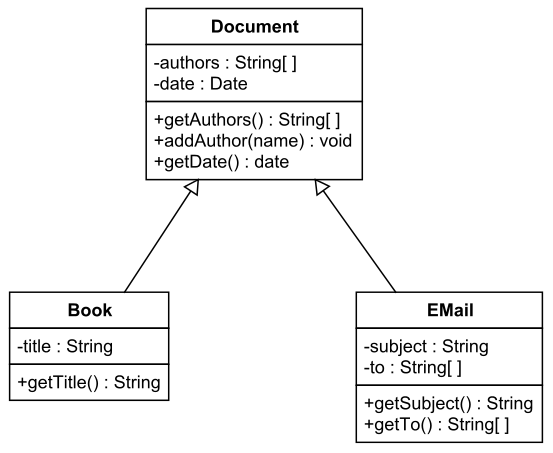

# Лабораторна робота 3 : Повторне використання коду. Успадкування та композиція

> Перевірте правильність виконання завдань 1 - 4 за допомогою модульних тестів.

## Завдання 1. Клас `DiscountBill`

Дан клас `GroceryBill`, який моделює чек та зберігає список товарів, який купляє людина у магазині.

> Опис класу `GroceryBill` наведений в документації, яка знаходиться в директорії `docs`

Розробіть клас `DiscountBill`, який розширює клас `GroceryBill` та додає логіку для обліку знижок для постійних клієнтів. Конструктор класу `DiscountBill` повинен приймати на вхід аргумент, який вказує, чи є покупець постійним.

Клас `DiscountBill` повинен реалізувати власну логіку методу `getTotal()` для постійних клієнтів. Наприклад, якщо повна сума становить 80 гривень, а знижка для постійного клієнта становить 20 гривень, метод повинен повернути 60 гривень.

Крім того, вам потрібно відслідковувати кількість товарів зі знижкою (які мають розмір знижки більше `0.0`), а також загальну знижку, як у гривнях, так і в відсотках від суми в чеку (тобто наскільки в відсотках постійний покупець заплатив менше, ніж у випадку коли б він був звичайним покупцем).

Окрім перевизначених методів, клас `DiscountBill` повинен мати наступні конструктори та публічні методи:

- `public DiscountBill (Employee clerk, boolean regularCustomer)` - створює об'єкт `DiscountBill` для даного `clerk`;
- `public int getDiscountCount()` - повертає кількість товарів зі знижкою;
- `public double getDiscountAmount()` - повертає загальну знижку в гривнях;
- `public double getDiscountPercent()` - повертає відсоток знижки на товари (на скільки відсотків покупець заплатив менше). Відсоток можна обчислити за формулою: `100 - (ціна зі знижкою * 100) / повна ціна`.

Якщо покупець не є регулярним, клас `DiscountBill` повинен поводити себе так, ніби загальна знижка становить `0.0` та всі товари повинні враховуватися за повну вартість.

## Завдання 2. Клас `MinMaxAccount`

Компанія розробила великий та складний клас `BankingAccount` з багатьма методами.

> Опис класу `BankingAccount` наведений в документації, яка знаходиться в директорії `docs`

Розробіть новий клас `MinMaxAccount`, об'єкти якого можуть бути використані замість об'єктів класу `BankingAccount`. Клас `MinMaxAccount` включає додаткову поведінку - він запам'ятовує мінімальне та максимальне значення балансу, яке було зафіксоване на балансі рахунку. Ви повинні надати ті ж самі методи, що і суперклас, а також наступну нову поведінку:

- `public MinMaxAccount(Startup s)` - створює об'єкт `MinMaxAccount`, використовуючи інформацію в об'єкті класу `Startup`
- `public int getMin()` - повертає мінімальне значення балансу у копійках
- `public int getMax()` - повертає максимальне значення балансу у копійках

Конструктор `BankingAccount` визначає початкове значення балансу, виходячи з інформації в об'єкті класу `Startup`.

В рамках задачі визначено, що значення балансу змінюється тільки в методах `debit()` та `credit()`.

## Завдання 3. Клас `Point3D`

Дан клас `Point`, який моделює точку у двомірному просторі. Клас включає в себе наступні конструктори та публічні методи

> Опис класу `Point` наведений в документації, яка знаходиться в директорії `docs`

Створіть клас `Point3D`, який розширює клас `Point` через успадкування. Він повинен вести себе як клас `Point`, за виключенням того, що це повинна бути точка у тривимірному просторі, яка додатково зберігає значення координати `z`.

Ви повинні надати ті ж самі методи, що і суперклас, а також реалізувати додаткову поведінку:

- `public Point3D()` - створює точку з координатами `(0,0,0)`;
- `public Point3D(int x, int y, int z)` - створює точку з координатами `(x,y,z)`;
- `public void setLocation(int x, int y, int z)` - встановлює нові координати точки;
- `public double distance(Point3D p)` - повертає відстань від поточної точки до вхідної точки за формулою відстані Евкліда з урахуванням координати `z`;
- `public int getZ()` - повертає координату `z`;

Клас `Point3D` повинен перевизначити необхідні методи, щоб вони працювали коректно з урахуванням третьої координати. Також клас `Point3D` повинен вести себе інакше в наступних ситуаціях:

- при виклику методу `setLocation(int x, int y)`, координата z повинна бути виставлена в `0`;
- при виклику методу `toString()`, рядок повинен виводити дані трьох точок, а не двох;
- метод `distanceFromOrigin()` повинен враховувати координату z та повертати відстань за формулою $\sqrt{(x_1-x_2)^2 + (y_1-y_2)^2 + (z_1-z_2)^2}$

## Завдання 4. Клас `DiscountBill` за допомогою композиції

Виконайте перше завдання за допомогою механізму композиції. Перевірте правильність виконання завдання за допомогою тестів.

Не змінюйте вихідний код з першого завдання. Новий клас назвіть `DiscountBill2`.

## Завдання 5. Перетворення діаграми UML у вихідний код

Дані наступні діаграми класів UML

Створіть відповідні класи, поля та методи (тіла методів писати не треба - тільки заголовки)
